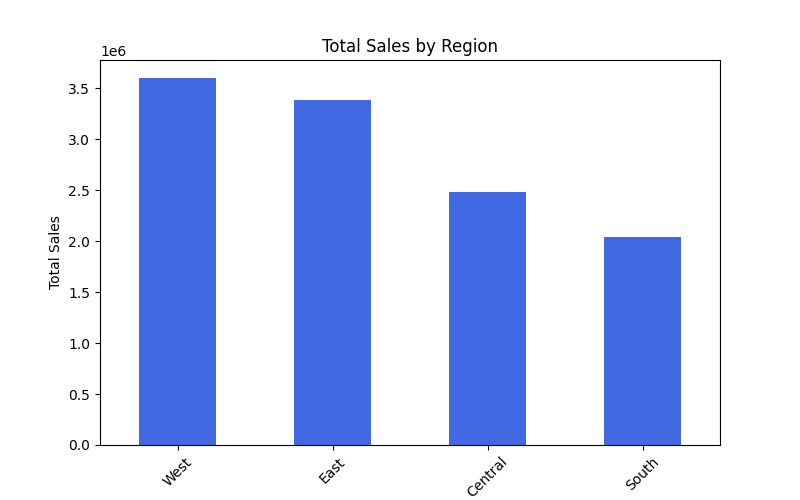
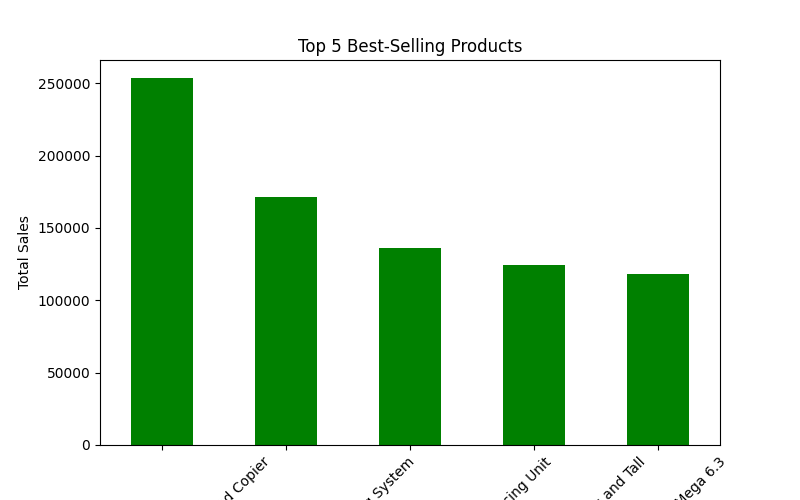
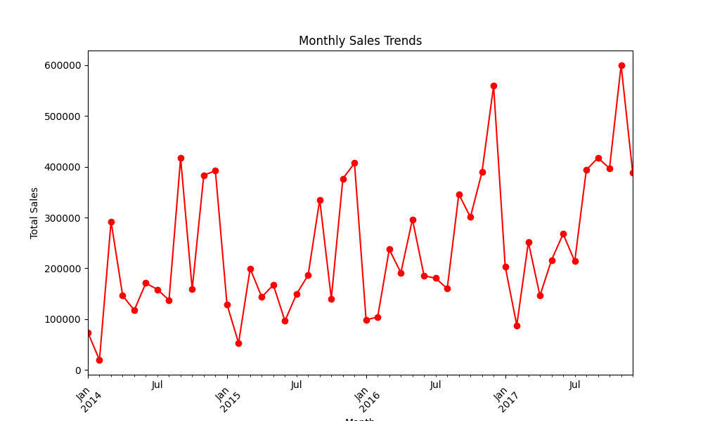

# 🛒 Superstore Sales Analysis

## 📌 Project Overview
This project analyzes sales data from a **Superstore Dataset** to extract meaningful business insights. The goal is to identify sales trends, best-selling products, and revenue patterns over time. This project is valuable for businesses looking to optimize product performance and regional sales strategies.

## 🚀 Key Features
- **Sales by Region** → Identifies which regions generate the most revenue.
- **Top 5 Best-Selling Products** → Highlights products contributing the most to sales.
- **Monthly Sales Trends** → Analyzes sales growth and seasonal fluctuations.
- **Data Cleaning & Preprocessing** → Handles missing values and ensures accurate analysis.
- **Data Visualization** → Uses Matplotlib & Seaborn to generate insightful charts.

## 🏗️ Technologies Used
- **Python** → Data processing and analysis.
- **pandas** → Data wrangling and manipulation.
- **matplotlib & seaborn** → Data visualization.

## 📂 Folder Structure
```
Superstore_Sales_Analysis/
│── data/
│   ├── sales_data.csv   # Dataset file
│── images/
│   ├── sales_by_region.png   # Visualization of sales by region
│   ├── top_products.png   # Visualization of top 5 products
│   ├── monthly_sales.png   # Visualization of monthly trends
│── scripts/
│   ├── sales_analysis.py   # Python script for analysis
│── README.md   # Project documentation
│── requirements.txt   # Python dependencies
```

## 📥 Installation & Setup
To run this project on your local system:

1. **Clone the Repository**
   ```bash
   git clone https://github.com/VIGNESH54/Superstore_Sales_Analysis.git
   cd Superstore_Sales_Analysis
   ```
2. **Create & Activate Virtual Environment**
   ```bash
   python3 -m venv venv
   source venv/bin/activate  # macOS/Linux
   venv\Scripts\activate  # Windows
   ```
3. **Install Dependencies**
   ```bash
   pip install -r requirements.txt
   ```
4. **Run the Analysis Script**
   ```bash
   python scripts/sales_analysis.py
   ```

## 📊 Sample Output & Insights
### **1️⃣ Total Sales by Region**

- **West** generates the highest revenue, followed by **East**.

### **2️⃣ Top 5 Best-Selling Products**

- **Canon imageCLASS 2200 Advanced Copier** is the best-selling product.

### **3️⃣ Monthly Sales Trends**

- Peak sales are seen during November and December, suggesting seasonal trends.

## 🎯 Business Impact
This analysis helps businesses:
- **Identify high-performing regions** to focus marketing efforts.
- **Optimize product strategy** based on best-selling items.
- **Plan seasonal promotions** based on past trends.

## 🤝 Contribution
Feel free to fork this project, submit pull requests, or reach out for collaborations.

## 📞 Contact
**GitHub:** [VIGNESH54](https://github.com/VIGNESH54)  
**Email:** vignesh23557@gmail.com
